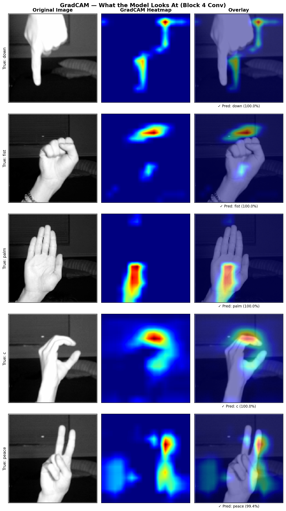
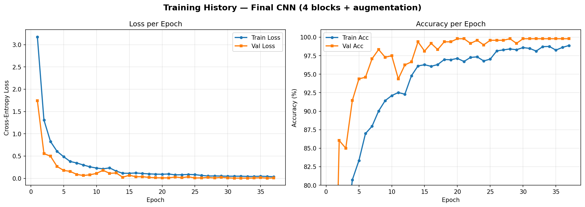
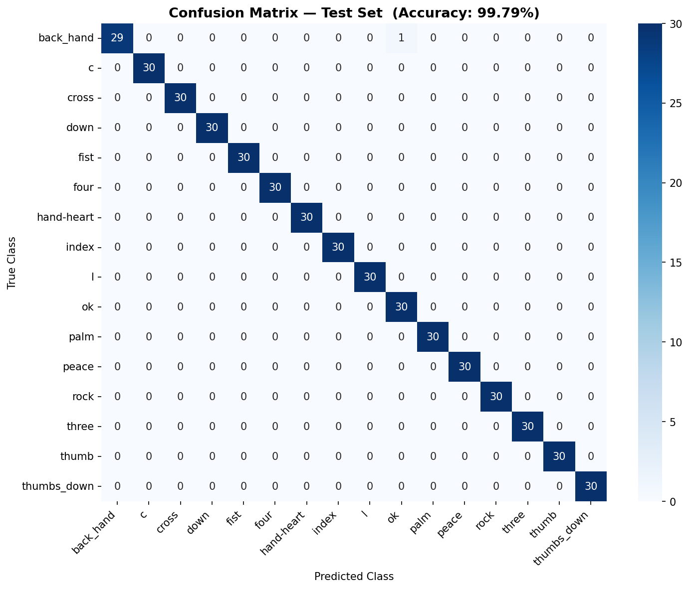

<h1 align="center">Hand Gesture Recognition CNN</h1>

<p align="center">
  
  
  
  
</p>

<p align="center">
  A custom convolutional neural network built from scratch that classifies <strong>16 hand gestures</strong> in real time using a webcam.<br/>
  Trained entirely on a <strong>self-collected dataset</strong> of 4,800 images captured with <code>collect_gestures.py</code>.
</p>

<p align="center">
  
  <br/>
  <em>GradCAM — the model's attention overlaid on live webcam frames. Each prediction is 100% confident.</em>
</p>

---

## Highlights

| | |
|---|---|
| **Test Accuracy** | 99.79% (479 / 480 correct) |
| **Classes** | 16 hand gestures |
| **Dataset** | Self-collected via webcam — 300 images × 16 classes = 4,800 total |
| **Architecture** | 4-block CNN built from scratch — no pretrained weights |
| **Regularization** | Dropout, BatchNorm, L2 weight decay, data augmentation |
| **Training** | ReduceLROnPlateau scheduler + early stopping |
| **Explainability** | GradCAM heatmaps showing which pixels drive each prediction |
| **Demo** | Live webcam inference with real-time class overlay |

---

## Gesture Classes

`back_hand` · `c` · `cross` · `down` · `fist` · `four` · `hand-heart` · `index` · `l` · `ok` · `palm` · `peace` · `rock` · `three` · `thumb` · `thumbs_down`

---

## Architecture

```
Input: 1 × 128 × 128 (grayscale)
│
├─ Block 1: Conv2d(1→32)  + BN + ReLU + MaxPool  →  32 × 64 × 64
├─ Block 2: Conv2d(32→64) + BN + ReLU + MaxPool  →  64 × 32 × 32
├─ Block 3: Conv2d(64→128)+ BN + ReLU + MaxPool  → 128 × 16 × 16
├─ Block 4: Conv2d(128→256)+BN + ReLU + MaxPool  → 256 ×  8 ×  8
│
└─ Classifier: Flatten → Linear(16384, 512) → ReLU → Dropout(0.4) → Linear(512, 16)

Total trainable parameters: ~8.4M
```

**Training setup**
- Loss: `CrossEntropyLoss`
- Optimizer: Adam (`lr=0.001`, `weight_decay=1e-4`)
- Scheduler: `ReduceLROnPlateau` — halves LR after 3 epochs of no improvement
- Early stopping: patience of 7 epochs, restores best weights on stop
- Data augmentation: random horizontal flip, ±15° rotation, brightness/contrast jitter

---

## Results

### Training Curves

<p align="center">
  
</p>

Validation accuracy breaks 98% by epoch 5 and converges to ~100% by epoch 20. The scheduler's LR reductions are visible as the sharp drops in training loss around epochs 15–25.

### Confusion Matrix — Test Set

<p align="center">
  
</p>

**Only 1 misclassification out of 480 test samples.** The model confused `back_hand` with `ok` once — two gestures that share similar finger curvature from certain angles.

---

## GradCAM Explainability

<p align="center">
  
</p>

GradCAM (Gradient-weighted Class Activation Mapping) visualizes which regions of the input image most influenced the prediction. The heatmaps confirm the model has learned meaningful features — it focuses on finger positions and hand shape rather than background noise.

---

## Quick Start

### 1. Clone & install dependencies

```bash
git clone https://github.com/CZ140/hand-gesture-recognition-cnn.git
cd hand-gesture-recognition-cnn
pip install torch torchvision scikit-learn matplotlib seaborn pillow opencv-python
```

### 2. Collect your own gesture data *(optional)*

```bash
python collect_gestures.py
```

Launches a webcam window. Press the displayed key to record 300 frames per gesture class into `my_gesture_data/`.

### 3. Train the model

Open `Final Model Submission/hand_gesture_final.ipynb` in Jupyter and run all cells.  
Set `USE_CUSTOM_DATASET = True` to train on your own data, or `False` to use the LeapGestRecog dataset from Kaggle ([gti-upm/leapgestrecog](https://www.kaggle.com/datasets/gti-upm/leapgestrecog)).

### 4. Run the live webcam demo

The final cell of `hand_gesture_final.ipynb` launches a real-time inference demo. Hold your hand in the green bounding box — predictions and confidence scores appear as an overlay.

> **Note:** A trained `best_final_model.pth` is required. Model weights are not stored in this repo due to file size — train from the notebook or contact me for the weights file.

---

## Project Structure

```
├── Final Model Submission/
│   ├── hand_gesture_final.ipynb   # final model — 4 blocks, augmentation, GradCAM, webcam demo
│   ├── collect_gestures.py        # webcam data collection script
│   ├── final_training_curves.png
│   ├── final_confusion_matrix.png
│   └── gradcam_samples.png
│
├── hand_gesture_baseline.ipynb    # baseline model — 3 blocks, LeapGestRecog dataset
├── gesture_final.ipynb            # exploratory notebook
├── collect_gestures.py
└── .gitignore
```

---

## Built With

- [PyTorch](https://pytorch.org/) — model architecture, training loop, GradCAM
- [scikit-learn](https://scikit-learn.org/) — train/val/test split, metrics, confusion matrix
- [OpenCV](https://opencv.org/) — webcam capture and real-time inference overlay
- [Matplotlib](https://matplotlib.org/) / [Seaborn](https://seaborn.pydata.org/) — visualization

---

<p align="center">Made by <strong>Chris Marrero</strong></p>
